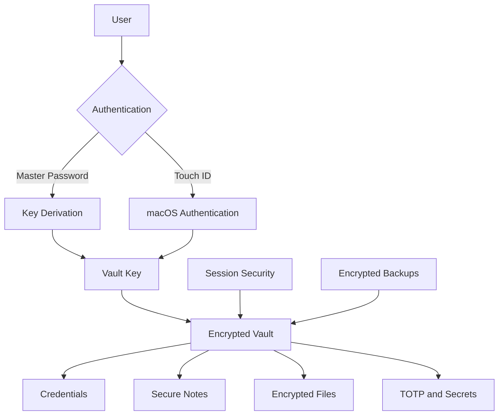
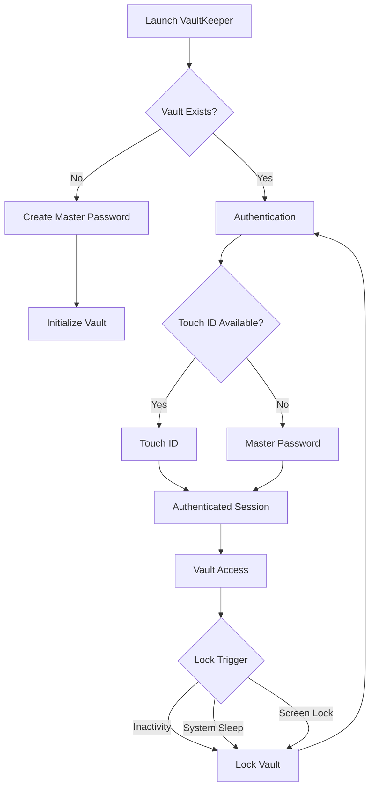
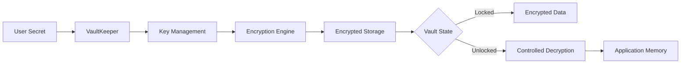
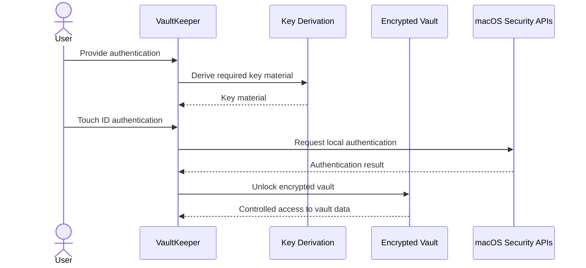
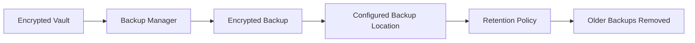
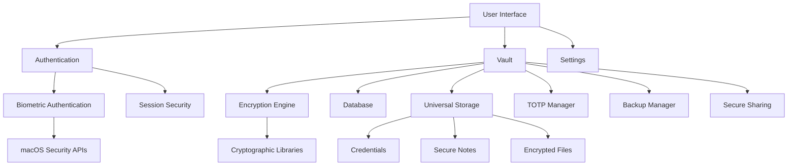

# VaultKeeper

<p align="center">
  <strong>Secure Local Vault for Passwords, Secrets, Notes & Files</strong><br>
  Privacy-first • Offline-first • macOS • Touch ID
</p>

<p align="center">
  
  
  
  
</p>

<p align="center">
  A local-first encrypted vault for credentials, notes, files, TOTP secrets and other sensitive data.
</p>

---

## Overview

VaultKeeper is a macOS-focused security application designed to keep sensitive information inside a local encrypted vault.

It combines password authentication, Argon2id-based password protection, Touch ID integration, encrypted storage, password security tooling, TOTP management, backup management, and session controls.

> **Sensitive data should remain under the user's control.**

VaultKeeper is designed for local and offline operation rather than relying on a remote service to store normal vault contents.

---

## Security Architecture



---

## Authentication Flow



---

## Encryption & Data Protection



VaultKeeper is designed so that sensitive information is encrypted before being persisted to local storage.

---

## Encryption Flow



---

# Core Features

## Authentication

* Master-password authentication
* Argon2id-based password handling
* Touch ID integration on supported macOS hardware
* Master-password fallback
* Automatic session locking
* Configurable inactivity timeout
* Locking after system sleep
* Locking after screen lock

## Encrypted Vault

VaultKeeper provides a unified encrypted environment for:

* Credentials
* Secure notes
* Files
* TOTP secrets
* Sensitive information

## Password Management

* Secure password generation
* Configurable password length
* Character-set controls
* Symbol controls
* Passphrase generation
* PIN generation
* High-security presets
* Web-safe presets
* Ambiguous-character exclusion
* Password strength analysis
* Weak-password identification
* Duplicate-password detection
* Breach detection

## Secure Notes

Store sensitive text securely inside the vault with support for:

* Categories
* Tags
* Search
* Favorites

## Universal Storage

VaultKeeper supports encrypted storage for multiple types of sensitive information, including:

* Documents
* Images
* Videos
* Credentials
* Notes
* Other private files

## TOTP & Authentication Secrets

VaultKeeper includes TOTP management for accounts using time-based one-time passwords.

Typical use cases include:

* GitHub
* Google
* Microsoft
* AWS
* Other TOTP-enabled services

## Session Security

VaultKeeper includes session controls designed to reduce the exposure window of an unlocked vault.

* Automatic locking
* Inactivity timeout
* Session management
* Locking after system events
* Controlled access to sensitive information

---

## Encrypted Backups



Backups should be treated with the same level of care as the primary vault.

---

# Application Architecture



---

# Project Structure

```text
vaultkeeper/
│
├── advanced/
│   ├── backup_manager.py
│   ├── biometric_auth.py
│   ├── database_advanced.py
│   ├── encryption_advanced.py
│   ├── password_generator.py
│   ├── password_security.py
│   ├── secure_sharing.py
│   ├── security_utils.py
│   ├── session_security.py
│   ├── totp_manager.py
│   └── universal_storage.py
│
├── config/
│   ├── __init__.py
│   └── settings.py
│
├── ui/
│   ├── __init__.py
│   ├── login_window.py
│   ├── main_window.py
│   ├── password_generator_ui.py
│   ├── settings_window.py
│   └── vault_window.py
│
├── tests/
│   ├── __init__.py
│   ├── test_encryption.py
│   ├── test_password_gen.py
│   └── test_security.py
│
├── docs/
│   ├── api_reference.md
│   ├── security_model.md
│   └── user_guide.md
│
├── app.py
├── database.py
├── encryption.py
├── main.py
├── password_recovery.py
├── requirements.txt
├── LICENSE
└── README.md
```

---

# Technology Stack

| Layer                | Technology                      |
| -------------------- | ------------------------------- |
| Language             | Python                          |
| Cryptography         | `cryptography`                  |
| Password Security    | `argon2-cffi`                   |
| TOTP                 | `pyotp`                         |
| QR Generation        | `qrcode`                        |
| macOS Authentication | PyObjC / LocalAuthentication    |
| macOS Security APIs  | PyObjC / Security               |
| Testing              | pytest                          |
| Static Analysis      | flake8 / pylint / mypy / bandit |

---

# Installation

## Requirements

* macOS
* Python 3.8+
* Xcode Command Line Tools
* Touch ID-enabled Mac for biometric authentication

## Clone

```bash
git clone https://github.com/anoshmishra/vaultkeeper.git
cd vaultkeeper
```

## Virtual Environment

```bash
python3 -m venv venv
source venv/bin/activate
```

## Install Dependencies

```bash
pip install -r requirements.txt
```

## Run

```bash
python3 main.py
```

---

# Usage

## Standard Launch

```bash
python3 main.py
```

## Debug Mode

```bash
python3 main.py --debug
```

## Version

```bash
python3 main.py --version
```

---

# First-Time Setup

On the first launch:

1. Create a master password.
2. Initialize the vault.
3. Enable Touch ID where supported.
4. Configure the automatic lock timeout.
5. Configure clipboard clearing.
6. Configure backup settings.

The master password is a critical authentication factor.

---

# Testing

Run the test suite:

```bash
pytest tests/ -v
```

Run coverage:

```bash
pytest --cov=advanced --cov-report=html
```

---

# Code Quality & Security Testing

```bash
flake8 advanced/ ui/ tests/
```

```bash
pylint advanced/ ui/
```

```bash
mypy advanced/ ui/
```

```bash
bandit -r advanced/ ui/
```

---

# Security Principles

VaultKeeper follows a defense-in-depth approach based on:

* Local-first processing
* Encryption at rest
* Strong password-based key derivation
* Platform authentication
* Least-privilege principles
* Minimal data exposure
* Explicit session boundaries
* Secure storage practices
* Automated testing

VaultKeeper does not claim that compromise is impossible. The objective is to reduce attack surface and protect sensitive information through established cryptographic primitives, platform security controls, and layered defenses.

---

# Privacy Model

VaultKeeper is designed for offline operation.

The application does not require a remote backend for normal vault access.

Sensitive vault contents are intended to remain within the local environment rather than being uploaded to a centralized server.

---

# Important Security Notes

### Master Password

The master password is a critical authentication factor.

Do not share it with anyone.

### Backups

Backups should be tested periodically to ensure they can actually be restored.

### Device Security

For the strongest overall security posture:

* Keep macOS updated.
* Keep FileVault enabled.
* Use a strong device password.
* Keep Touch ID protected.
* Protect backup locations.
* Avoid storing plaintext vault exports.

---

# Documentation

* [Security Model](docs/security_model.md)
* [API Reference](docs/api_reference.md)
* [User Guide](docs/user_guide.md)

---

# Project Status

VaultKeeper is actively developed.

Security-sensitive changes should be accompanied by appropriate testing and review.

---

# Roadmap

Potential future improvements include:

* Hardware security key integration
* Enhanced key management
* Stronger backup verification
* Improved secure-sharing workflows
* Advanced audit controls
* Additional platform security integrations
* Cross-platform support

---

# Contributing

Security-related improvements are especially welcome.

Before submitting changes:

1. Run the test suite.
2. Run static analysis.
3. Review cryptographic changes carefully.
4. Avoid introducing custom cryptographic primitives.
5. Document security-sensitive behavior.

---

# License

MIT License

Copyright © 2024–2026 Anosh Mishra

---

<p align="center">
  <strong>VaultKeeper</strong><br>
  Keep your secrets under your control.
</p>
